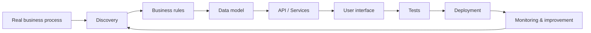

<div align="center">

```text
████████╗██╗  ██╗███████╗       ██╗   ██╗ ██████╗ ███╗   ██╗██╗  ██╗██╗   ██╗
╚══██╔══╝██║  ██║██╔════╝       ██║   ██║██╔═══██╗████╗  ██║██║ ██╔╝╚██╗ ██╔╝
   ██║   ███████║█████╗  ██████╗██║   ██║██║   ██║██╔██╗ ██║█████╔╝  ╚████╔╝
   ██║   ██╔══██║██╔══╝  ╚═════╝╚██╗ ██╔╝██║   ██║██║╚██╗██║██╔═██╗   ╚██╔╝
   ██║   ██║  ██║███████╗        ╚████╔╝ ╚██████╔╝██║ ╚████║██║  ██╗   ██║
   ╚═╝   ╚═╝  ╚═╝╚══════╝         ╚═══╝   ╚═════╝ ╚═╝  ╚═══╝╚═╝  ╚═╝   ╚═╝
```

# Deywid Braga · `The-Vonky`

### Systems Analyst · Full-stack Developer · Business Automation

**I turn spreadsheets, repetitive workflows and operational pain into reliable software.**

[](https://git.io/typing-svg)


</div>

---

## `> whoami`

```text
Name      : Deywid Braga
Alias     : The-Vonky
Role      : Systems Analyst / Full-stack Developer
Education : Information Systems — UNIPAM
Location  : Patos de Minas, MG — Brazil

Current focus:
→ Internal business systems
→ Process automation
→ Spreadsheet-to-software migration
→ Data reconciliation and traceability
→ Local-first applications
→ Reliable delivery, tests and CI
```

I currently work close to **real business operations**, where software has to do more than look good: it has to preserve rules, reduce manual work, survive updates, keep data safe and make the user's job easier.

A large part of my work starts with something like:

```text
Excel + manual process + repetitive validation + operational risk
                           ↓
                system design & modeling
                           ↓
         application + rules + tests + auditability
                           ↓
              safer and faster operation
```

---

# `> cat what-i-do.md`

## I build software around real processes

My strongest area today is transforming existing operational workflows into systems.

That usually involves:

- understanding the process before writing code;
- mapping business rules hidden inside spreadsheets;
- modeling data and validation rules;
- building interfaces for non-technical users;
- preserving original data and historical versions;
- automating repetitive tasks;
- validating edge cases and failure scenarios;
- creating safe backup, restore and migration flows;
- deploying software in Windows and internal-network environments.

I like projects where the problem is not simply **"make a CRUD"**, but:

> **"How do we turn this process into software without losing the rules that already make the business work?"**

---

# `> ls stack/ --current`

## Core languages

<div align="center">


</div>

## Web & APIs

<div align="center">


</div>

## Desktop & mobile

<div align="center">


</div>

## Data, backend services & infrastructure

<div align="center">


</div>

## Engineering workflow

<div align="center">


</div>

### Also part of my day-to-day

`REST APIs` · `JSON` · `Excel / OOXML` · `WSL2` · `Windows deployment` · `local networks` · `TLS` · `Git flow` · `PR review` · `data migration`

---

# `> cat current-work.log`

## Recent systems and problems I've been working on

> Most of my recent professional projects are private because they handle internal company processes, operational data and business rules.

### `01` Planejado × Realizado

A local-first business application for importing operational spreadsheets and comparing **planned vs. actual** data.

```text
Excel import
   ↓
Structural validation
   ↓
Business-rule validation
   ↓
Financial reconciliation
   ↓
Immutable confirmation
   ↓
History / comparison / export
   ↓
Backup / restore / migration
```

**What this project exercises:**

`FastAPI` · `React` · `TypeScript` · `SQLite` · `Excel` · `Decimal financial rules` · `versioned migrations` · `auditability` · `tests` · `CI`

Engineering concerns include:

- preserving original spreadsheets;
- rejecting invalid or unsafe imports;
- versioning rules and confirmed analyses;
- immutable historical snapshots;
- traceable corrections;
- financial calculations without floating-point shortcuts;
- backup integrity and restore protection;
- data continuity across application updates.

---

### `02` Contract Management System

Internal contract-management software developed in both **desktop/local** and **intranet** architectures.

**Areas involved:**

`React` · `TypeScript` · `Tauri` · `Rust` · `PostgreSQL` · `Docker` · `PowerShell` · `internal network deployment`

Features and concerns include:

- contract lifecycle and alerts;
- dashboards and KPIs;
- reporting;
- backup/restore;
- role-oriented operation;
- local-network access;
- TLS/certificate setup;
- deployment and startup automation.

---

### `03` ISO Proposal Registry

Migration of an operational Excel workflow into a web system.

**Stack:**

`FastAPI` · `React` · `Vite` · `TypeScript` · `SQLite`

Includes:

- Excel import;
- customer and proposal management;
- search and filtering;
- document organization;
- historical records;
- reporting.

---

### `04` Operational dashboards & analysis

I also build dashboards and internal analytical tools for operational data, including:

- ABC/Pareto analysis;
- satisfaction surveys;
- cost and consumption analysis;
- consolidation of multiple spreadsheets;
- automated reports;
- transformation of raw operational data into actionable views.

---

### `05` Mobile projects & prototypes

My mobile experience includes apps built with:

`React Native` · `Expo` · `TypeScript` · `Supabase` · `Firebase`

Public examples include:

- [OmniFit](https://github.com/The-Vonky/OmniFit)
- [MisParent](https://github.com/The-Vonky/MisParent)

---

# `> cat how-i-engineer.md`

The more responsibility a system has, the less I treat software as "just code".

```text
┌───────────────────────────────────────┐
│              PRINCIPLES               │
├───────────────────────────────────────┤
│ Preserve original data                │
│ Prefer versioning over overwrite      │
│ Test business rules                   │
│ Make failures visible                 │
│ Back up before destructive changes    │
│ Keep migrations auditable             │
│ Use PRs instead of pushing to main    │
│ Keep secrets and real data out of Git │
│ Design for the actual end user        │
└───────────────────────────────────────┘
```

What I increasingly care about in every project:

### Data integrity
If a system handles company data, losing or silently altering it is not acceptable.

### Traceability
Important actions should leave a record. A new version should not erase the previous one.

### Safe changes
Schema migrations, updates, imports and restores deserve explicit validation and rollback strategies.

### Tests
Tests are part of implementation, especially around business rules, calculations and failure paths.

### CI
A green interface is not enough. Automated verification should prevent broken code from being accepted.

### User operation
Good architecture is useless if the person using the system cannot understand what happened or what to do next.

---

# `> cat architecture-thinking.txt`



I like working close to the full lifecycle: understanding the problem, designing the model, implementing, testing, deploying and improving after real use.

---

# `> ls public-projects/`

<table>
<tr>
<td width="33%" valign="top">

### 🧬 [OmniFit](https://github.com/The-Vonky/OmniFit)

Health & fitness mobile application focused on workouts, diet, physical progress and UX.

**React Native · Expo · TypeScript · Supabase**

</td>
<td width="33%" valign="top">

### 👨‍👩‍👧 [MisParent](https://github.com/The-Vonky/MisParent)

Academic mobile project for parental activity management and monitoring.

**React Native · Expo · Firebase**

</td>
<td width="33%" valign="top">

### 🐄 [Fazenda Magalhães](https://github.com/The-Vonky/Fazenda-Magalhaes)

Academic system designed around a real dairy-farm management scenario.

**Web · Authentication · Dashboard · Management**

</td>
</tr>
</table>

> Public repositories are only part of my current work. Most recent business systems are private.

---

# `> ./stats.sh`

<div align="center">


</div>

<div align="center">


</div>

> Statistics above reflect public GitHub activity and therefore do not represent the full scope of private professional repositories.

---

# `> cat current-focus.txt`

```text
Business software     ██████████
Process automation    ██████████
Data reliability      █████████░
Testing & CI          █████████░
Architecture          ████████░░
Product thinking      ████████░░
Deployment            ████████░░
Always learning       ██████████
```

I'm currently strengthening the bridge between **software engineering and real business operations**:

- better architecture;
- safer data flows;
- stronger tests;
- reliable local deployments;
- cleaner update strategies;
- software that replaces manual work without becoming another operational problem.

---

# `> cat value-proposition.txt`

```text
I don't want to build software just because a process can be automated.

I want to understand:
- why the process exists;
- which rules actually matter;
- what can go wrong;
- what must never be lost;
- and what would make the user's day easier.

Then I build around that.
```

That is the kind of work I want to keep doing: **systems that solve operational problems, reduce friction and become part of how a company works.**

---

# `> ping deywid`

<div align="center">

[](https://github.com/The-Vonky)
[](mailto:deywidbraga.dev@gmail.com)

</div>

---

<div align="center">

```js
while (true) {
  understandProblem();
  modelBusinessRules();
  build();
  test();
  ship();
  observe();
  improve();
}
```

### **From spreadsheets to software. From manual work to reliable systems.**


</div>
