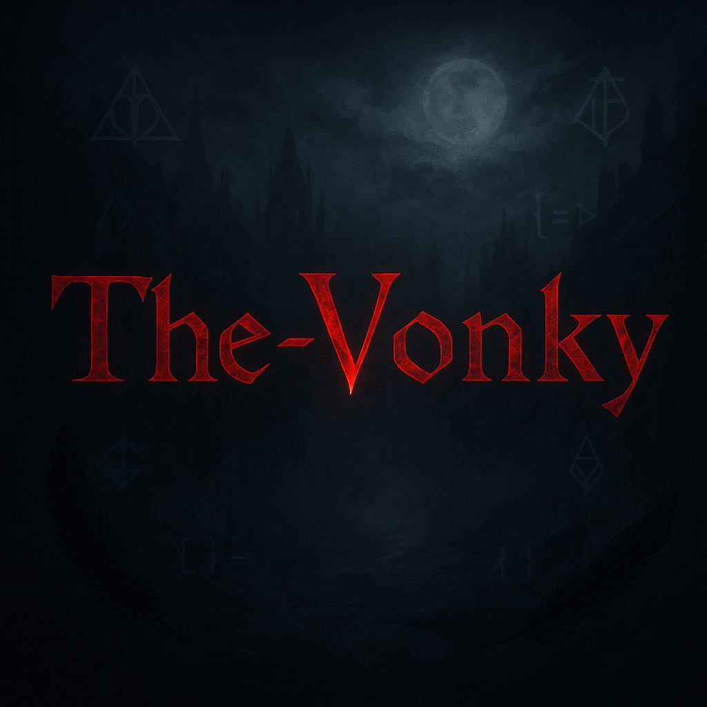

<h1 align="center">𖤐 The-Vonky 𖤐</h1>

  <em>“The moon hangs low, and the code grows wild.”</em>  

  

---

### 🧠 Sobre mim

🎓 Estudante de Sistemas de Informação (3º período)  
⚙️ Amante da lógica, da escuridão e dos `while(true)` existenciais  
💻 Aprendendo e explorando com **JavaScript**, mas já flertei com:  
`Java` • `Python` • `C` • `C#` • `HTML` • `CSS`

📫 Contato: deywidbraga14@gmail.com  
🔗 [LinkedIn](https://www.linkedin.com/in/deywidbraga)

---

### 🧰 Tech Stack
 

---

### 📊 GitHub Stats

  

  

  

---

### 🧩 Projetos em destaque

| Projeto | Descrição |
|--------|------------|
| `MisParent` | Aplicativo Mobile usando React Native e Firebase (em progresso) |
| `Fazenda Magalhães` | Protótipo de site administrativo |
| `portfolio-web` | Meu portfólio pessoal (em construção) |

---

  <i>“A mente que se afunda no código não retorna a mesma.”</i>

